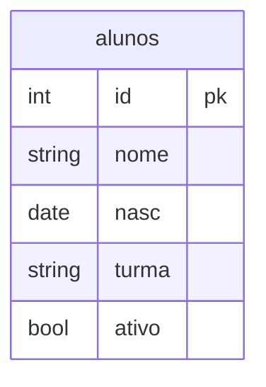
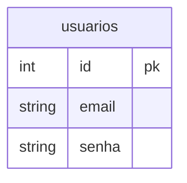

# 📚 Sistema de Gerenciamento de Alunos

Sistema web simples, feito basicamente com PHP puro, com banco de dados PostgreSQL, para cadastrar, consultar, atualizar e excluir alunos de uma escola (virtual). Também conta com uma área de login para controlar quem pode acessar o sistema.

---

## 📌 Sumário

1. [Sobre o projeto](#-sobre-o-projeto)
2. [Requisitos funcionais](#-requisitos-funcionais)
3. [Como o sistema funciona](#-como-o-sistema-funciona)
4. [Estrutura de pastas](#-estrutura-de-pastas)
5. [Tecnologias utilizadas](#-tecnologias-utilizadas)
6. [Banco de dados](#-banco-de-dados)
7. [Como instalar e rodar o projeto](#-como-instalar-e-rodar-o-projeto)
8. [Como usar o sistema](#-como-usar-o-sistema)

---

## 🧭 Sobre o projeto

Este é um mini sistema de gerenciamento de alunos, pensado para praticar conceitos de PHP, PDO (conexão com banco de dados) e operações básicas de **CRUD** (Criar, Ler, Atualizar e Excluir).

O sistema permite:

- Cadastrar novos alunos (nome, turma, data de nascimento e situação de ativo/inativo).
- Consultar um aluno específico pelo ID.
- Listar todos os alunos cadastrados.
- Atualizar os dados de um aluno.
- Excluir um aluno pelo ID.
- Criar uma conta de usuário e fazer login/logout para acessar as áreas protegidas do sistema.

---

## ✅ Requisitos funcionais

### Gestão de alunos

| # | Requisito | Descrição |
|---|-----------|-----------|
| 1 | Cadastrar alunos | Recebe nome, turma, data de nascimento e status (ativo/inativo). |
| 2 | Excluir alunos | Exclui um aluno específico a partir do ID. |
| 3 | Listar aluno | Consulta um aluno específico pelo ID. |
| 4 | Listar todos os alunos | Gera um relatório com todos os alunos cadastrados. |
| 5 | Atualizar aluno | Atualiza o cadastro de um aluno a partir do ID. |

### Login

| # | Requisito | Descrição |
|---|-----------|-----------|
| 1 | Cadastrar usuário | Cria um novo usuário (e-mail e senha) para acessar o sistema. |
| 2 | Página de login | Permite que o usuário entre no sistema. |
| 3 | Página de logout | Permite que o usuário saia do sistema. |
| 4 | Verificação de login | Impede o acesso às páginas do sistema por quem não estiver logado. |

---

## ⚙️ Como o sistema funciona

O sistema segue um fluxo bem direto, sem frameworks: cada página `.php` é responsável por uma ação.

1. **`index.php`** é a página inicial, com uma mensagem de boas-vindas e o menu de navegação.
2. O menu (`includes/header.php`) dá acesso às páginas de **Cadastrar**, **Excluir**, **Relatório** (listar todos), **Aluno** (consultar por ID), **Atualizar**, **Login** e **Sair** por meio de um header que é incluso em todos as outras páginas do sistema.
3. Antes de abrir qualquer página da pasta `app/` (cadastrar, excluir, listar, atualizar), o sistema verifica se o usuário está logado através do arquivo `login/verifica-login.php`. Se não estiver, ele é redirecionado para a tela de login automaticamente.
4. Cada página de `app/` monta um formulário HTML e, quando o formulário é enviado (`POST`), chama uma função correspondente do arquivo `includes/functions.php`, que executa o comando no banco de dados usando **PDO** (a forma segura e padrão do PHP de se conectar a bancos de dados).
5. A conexão com o banco fica centralizada em `database/connect.php`, que é incluída sempre que alguma página precisa falar com o banco. Esse arquivo é propositalmente escondido por segurança, mas você pode recriar ele usando o seguinte modelo:

```php
<?php 
$host = "000.000.00.00";
$dbname = "nomeDB";
$user = "usuarioDB";
$pass = "senhaUsuario";

try {
    $conexao = new PDO(
        "pgsql:host=$host;
        dbname=$dbname",
        $user,
        $pass
    );
} catch (PDOException $e) {
    echo "Erro: " .$e->getMessage();
}
?>
```

Resumindo, o fluxo de uma ação (por exemplo, cadastrar um aluno) é:

```
Usuário preenche o formulário → create.php recebe os dados (POST)
→ chama a função cadastrar() em functions.php
→ functions.php executa o INSERT no banco via connect.php
→ mensagem de sucesso é exibida na tela
```

---

## 🗂️ Estrutura de pastas

```
sistema-php/
├── index.php                  # Página inicial
├── documentacao.md            # Este arquivo de documentação
├── tabela.md                  # Estrutura da tabela "alunos"
│
├── app/                        # Páginas de ações sobre os alunos
│   ├── create.php              # Cadastrar aluno
│   ├── select.php               # Listar todos os alunos
│   ├── select_w.php             # Consultar um aluno pelo ID
│   ├── update.php               # Atualizar aluno
│   └── delete.php               # Excluir aluno
│
├── database/
│   └── connect.php              # Conexão com o banco de dados (PDO)
│
├── includes/
│   ├── header.php                # Menu de navegação
│   ├── footer.php                # Rodapé (atualmente vazio)
│   └── functions.php             # Funções que fazem as consultas no banco
│
├── login/
│   ├── login.php                 # Tela de login
│   ├── cadastrar.php             # Cadastro de novos usuários
│   ├── logout.php                # Encerra a sessão do usuário
│   └── verifica-login.php        # Protege as páginas internas
│
└── style/
    └── style.css                  # Estilo visual do sistema
```

---

## 🛠️ Tecnologias utilizadas

- **PHP** — linguagem principal do sistema, sem uso de frameworks.
- **PDO (PHP Data Objects)** — usado para conectar e conversar com o banco de dados de forma segura.
- **PostgreSQL** — banco de dados relacional onde os dados são armazenados.
- **HTML e CSS** — estrutura e estilo das páginas.
- **Sessões PHP (`$_SESSION`)** — usadas para controlar o login do usuário.

---

## 🗄️ Banco de dados

O sistema utiliza um banco de dados PostgreSQL chamado **`escola`**.

### Tabela `alunos`



### Tabela `usuarios`

O sistema também precisa de uma tabela para guardar os usuários que podem fazer login (usada pelas telas de `login.php` e `cadastrar.php`). Essa tabela **não veio pronta no projeto**, então é necessário criá-la manualmente com uma estrutura parecida com esta:



> ⚠️ **Atenção:** no código atual, a senha é salva e comparada como texto puro (sem criptografia). Isso é aceitável para fins de estudo, mas **não deve ser usado em um sistema real**. 

---

## 🚀 Como instalar e rodar o projeto

### 1. Pré-requisitos

Antes de começar, você precisa ter instalado na sua máquina:

- **PHP** (versão 7.4 ou superior)
- **PostgreSQL** (servidor de banco de dados)
- Um servidor local para rodar PHP, como o **servidor embutido do próprio PHP** ou algum outro servidor externo usando, por exemplo, o Moba.
- Extensão **`pdo_pgsql`** habilitada no PHP (necessária para conectar ao PostgreSQL)

### 2. Baixe o projeto

Extraia os arquivos do sistema em uma pasta local, por exemplo `sistema-php/`.

### 3. Crie o banco de dados

Acesse o PostgreSQL (pelo terminal ou outra ferramenta de sua preferência) e crie o banco e as tabelas:

```sql
CREATE DATABASE escola;

\c escola

CREATE TABLE alunos (
    id SERIAL PRIMARY KEY,
    nome VARCHAR(100) NOT NULL,
    nasc DATE,
    turma VARCHAR(50),
    ativo BOOLEAN DEFAULT false
);

CREATE TABLE usuarios (
    id SERIAL PRIMARY KEY,
    email VARCHAR(100) NOT NULL UNIQUE,
    senha VARCHAR(100) NOT NULL
);
```

### 4. Configure a conexão com o banco

Abra o arquivo `database/connect.php` e ajuste os dados de acordo com o seu ambiente:

```php
$host = "localhost";   // endereço do seu banco de dados
$dbname = "escola";    // nome do banco criado
$user = "seu_usuario"; // usuário do PostgreSQL
$pass = "sua_senha";   // senha do usuário
```

> 💡 Por padrão, o arquivo está configurado com um endereço de rede específico (`192.168.10.19`) e usuário/senha `escola`. Troque esses valores pelos dados do seu próprio banco de dados.

### 5. Rode o servidor local

Dentro da pasta do projeto (a pasta que fica **acima** de `sistema-php/`, ou seja, a pasta que contém a pasta `sistema-php/`), rode o servidor embutido do PHP:

```bash
php -S localhost:8000
```

> ⚠️ Como os links do menu (`includes/header.php`) usam caminhos como `/sistema-php/index.php`, a pasta do projeto precisa se chamar exatamente **`sistema-php`** e estar na raiz do servidor.

### 6. Acesse o sistema

Abra o navegador e acesse:

```
http://localhost:8000/sistema-php/index.php
```

---

## 🖱️ Como usar o sistema

1. **Crie uma conta** clicando em "Login" no menu e depois em "cadastrar" (ou acesse diretamente `login/cadastrar.php`).
2. **Faça login** com o e-mail e senha cadastrados.
3. Com o login feito, use o menu para:
   - **Cadastrar**: adicionar um novo aluno.
   - **Excluir**: remover um aluno pelo ID.
   - **Relatório**: ver a lista de todos os alunos.
   - **Aluno**: consultar um aluno específico pelo ID.
   - **Atualizar**: editar os dados de um aluno já cadastrado.
4. Para sair, clique em **"Sair"** no menu.
